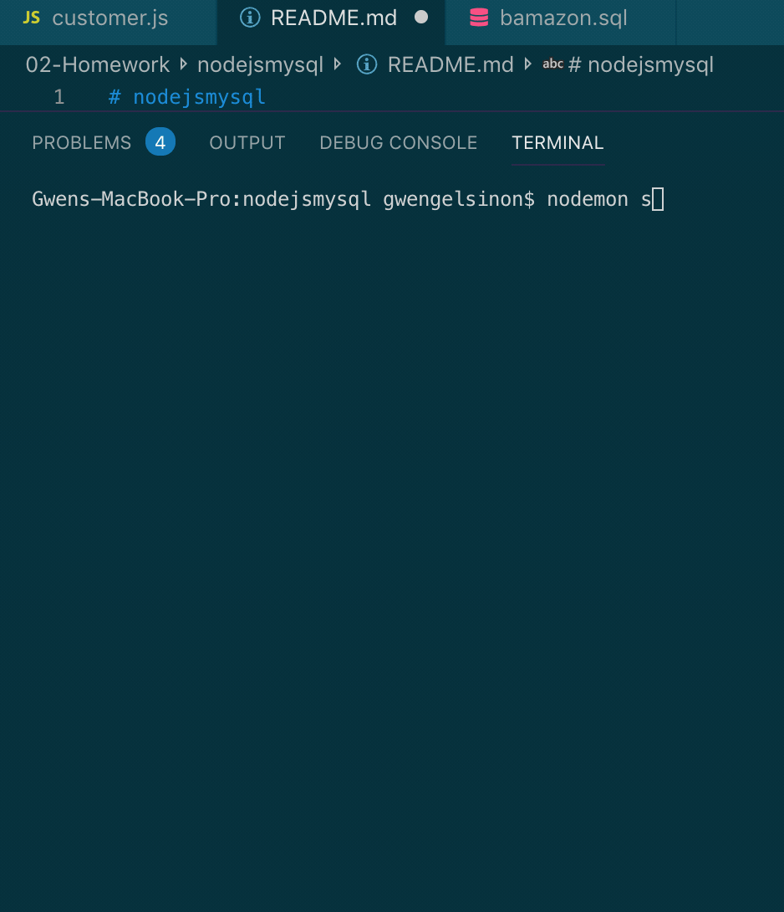

# nodejsmysql

Welcome to bamazon... Gelsinon style. Where you can purchase as much security, love and happiness as we have in stock (and you can afford)!!

This node, js, mysql app functions as follows:

An inventory of items, their available qty and price are stored in a sql database:

Using terminal and nodemon to interact with the application you can order products

If there is not sufficient quantity of the item you are attempting to order you will be notified and prompted to try again

When you try again, so long as you don't get greedy and order a reasonable amount of happines, love or security you will successfully complete your order

In the land of Bamazon there is a finite amount of love, security and happiness, 
so that inventory has to be tracked. Therefore after your purchase our database inventory is updated.
